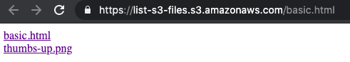

# List S3 Files

`List S3 Files` is a simple script to generate a single page clickable list of files from an S3 bucket.



## How to use this script?

First create an S3 bucket. Ours will be named `list-s3-files`.

Then upload `basic.html`.

In the `Permissions` tab, uncheck `Block all public access`.

Also in `Permissions`, in `Access control list (ACL)`, grant `Everyone (public access)` for `List`.

Finally, paste the following in the bucket policy section (adjust the arn with your bucket name):

```sh
{
    "Version": "2008-10-17",
    "Statement": [
        {
            "Sid": "PublicReadGetObject",
            "Effect": "Allow",
            "Principal": {
                "AWS": "*"
            },
            "Action": "s3:GetObject",
            "Resource": "arn:aws:s3:::list-s3-files/*"
        }
    ]
}
```
Now you can access https://list-s3-files.s3.amazonaws.com/basic.html from anywhere.

`basic.html` can be renamed to any filename.
